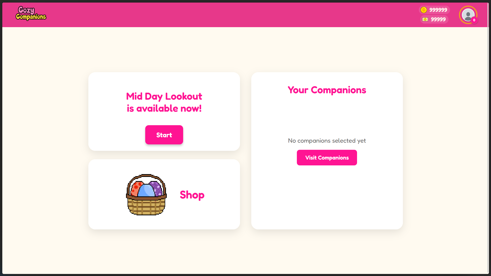
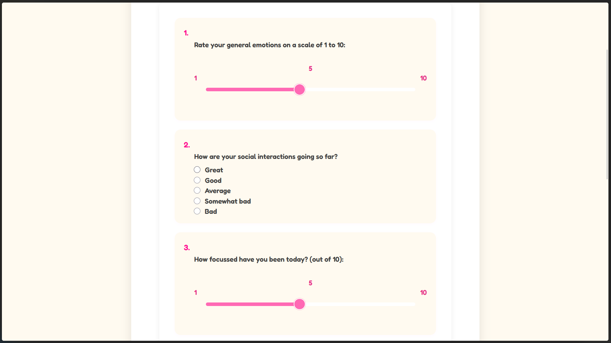
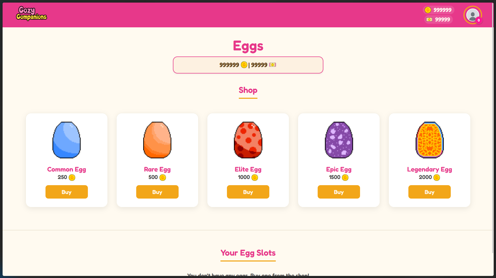
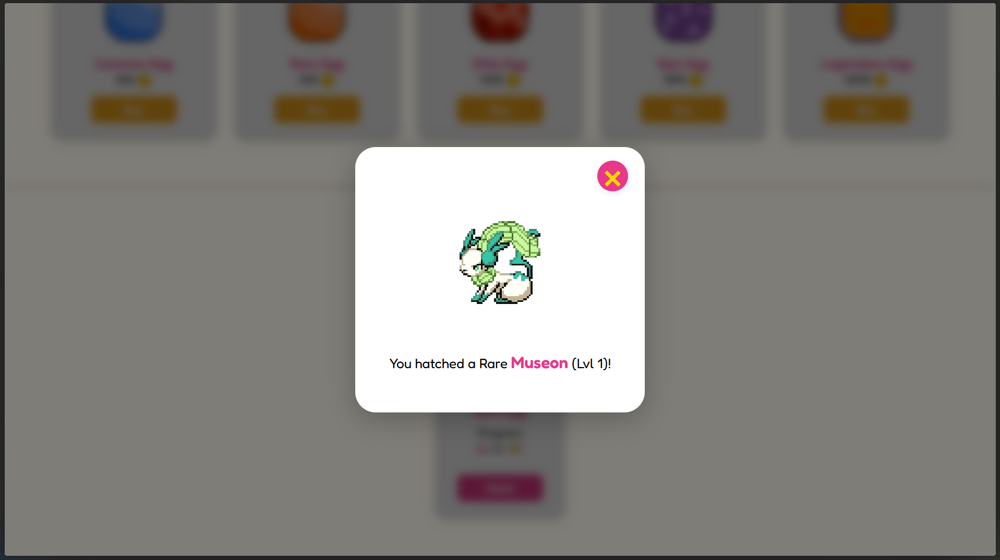
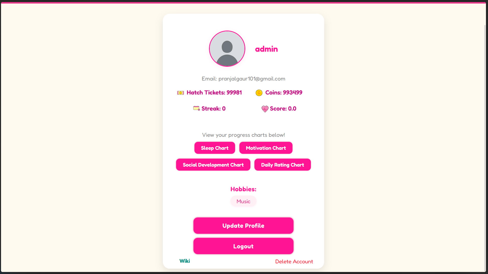
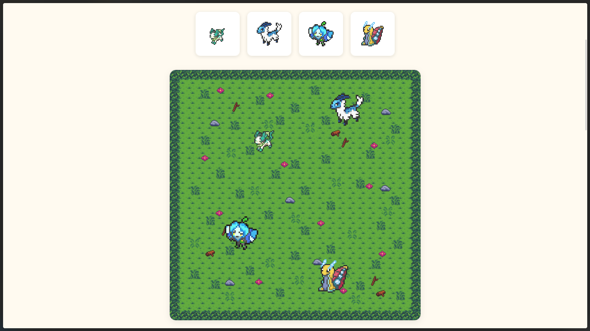
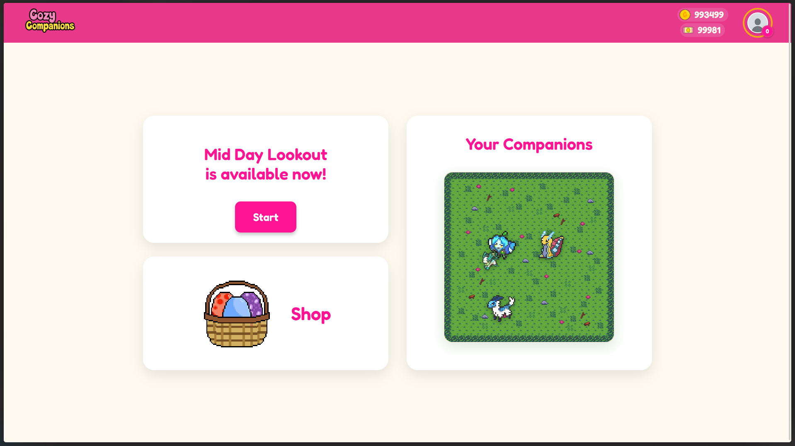
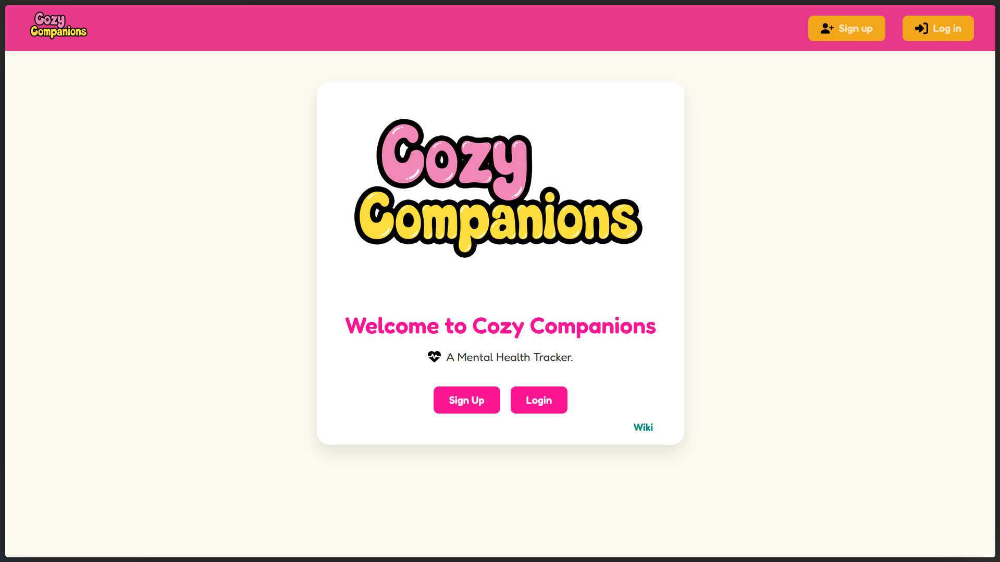

# CozyCompanions


[Wiki](Wiki.md)

# Screenshots








# Hosted URL
```bash
  https://cozycompanions.onrender.com/
```

# Features Implemented
## Frontend
1. Pages:
- Landing
- Homepage
- Login
- Register
- Profile Creation & Updation
- Profile
- Charts
- Questionnaires
- Wiki & List of Companions
- Shop Page
- Companions Page

2. Notable Features:
- Smooth animations using css ans js
- Random sprite movements
- Hathcing animations
- Forms
- Notifications popup

## Backend
1. Main Systems:
- User: Authentication, Profiles.
- Tracking: Forms, Charts, Score and Coins calculation, scheduling daily tasks.
- Companions: Eggs and hatching system, Companions collection system, 
  
2. Notable Features:
- Authentication is handled by Django.
- Customizable profile and tracking timings.
- Implemented a detailed algorithm to calculate score and coins recieved, taking various factors into consideration.
- Admins can create custom questions easily with admin panel.
- Logic for hatching, obtaining random Companions, Level system.
- Feeding system designed to keep users engaged.

# Technologies and Libaries Used
## Tech Stack
- Django w/ Python (Backend)
- HTML
- CSS
- JavaScript
- SQLitw (Local Deployment)
- PostgreSQL (Deploying on render.com)

## Libraries
### Python
- Django
- pytz (timezone library)
- APScheduler (automating tasks)

### JavaScript
- Chart.js

# To run:

1. Clone this repo:

```bash
  git clone https://github.com/cozy-companions/CozyCompanions-Public.git
```

2. go to project directory:

```bash
  cd CozyCompanions-Public
```

3. Setup Virtual Environment: (optional)

```bash
  python -m venv venv
```

4. Activate venv:

```bash
  .\venv\Scripts\activate.bat
```

5. Add a file `.env` to /project, The one with `manage.py`:
```bash
  cd project
```
```bash
  EMAIL = 
  PASS = 
  SECRET_KEY = 
  DJANGO_ALLOWED_HOSTS=cozycompanions.onrender.com,127.0.0.1,localhost
  DJANGO_CSRF_TRUSTED_ORIGINS=https://cozycompanions.onrender.com,http://127.0.0.1:8000
```
-  Copy this to the .env file you created
-  Add a gmail id and password or create an app password
-  To generate a django secret key, run this one at a time:
```bash
  python manage.py shell
  from django.core.management.utils import get_random_secret_key
  print(get_random_secret_key())
```
- Paste the generated key at `SECRET_KEY`

6. Run initial setup (ensure you are in root directory)

```bash
  initial-run.bat
```


7. For successive runs:

```bash
  run.bat
```

# Team Members
[Pranjal Gaur (2024BCS-052)](https://github.com/Pixel-7777)

[Shiv Thanmay (2024IMG-041)](https://github.com/Shiv-th)

[Sridhar Manokaran (2024IMG-045)](https://github.com/sridhar1923)

# Video
[](https://drive.google.com/file/d/1VKvZvQvH7xLIdZ1L84pj9Vuqc8G0hd5_/view?usp=sharing)


